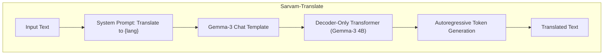
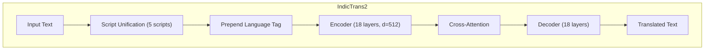
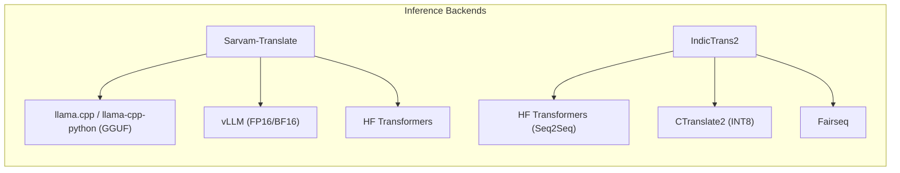

# Sarvam-Translate vs IndicTrans2: Architecture Deep-Dive and Local CPU POC

---

## Part A -- Architecture Deep-Dive and Comparison

### A1. Sarvam-Translate Architecture




- **Type**: Decoder-only causal LM (like GPT) fine-tuned for translation
- **Base**: Google Gemma-3-4B-IT (instruction-tuned)
- **Parameters**: ~4 Billion
- **Context**: 8192 tokens
- **How it translates**: The model receives a chat-style prompt where the system message says "Translate the text below to {language}" and the user message is the source text. It then autoregressively generates the translation token-by-token.
- **Tokenizer**: Gemma SentencePiece (general-purpose, not Indic-specialized)
- **License**: GPL-3.0

### A2. IndicTrans2 Architecture




- **Type**: Encoder-Decoder Transformer (classic seq2seq NMT, like mBART/NLLB)
- **Parameters**: 1.1B (full) / 200M (distilled)
- **Context**: 256 tokens (default); 2048 tokens (RoPE variants)
- **How it translates**: Source text is preprocessed through script unification (mapping multiple Indic scripts into 5 canonical scripts for better transfer learning), tagged with language codes, encoded, and then decoded into the target language.
- **Tokenizer**: Custom SPM with script-unified vocabulary
- **License**: MIT
- **Training data**: 230M bitext pairs (BPCC corpus)

### A3. Backend Differences




| Dimension           | Sarvam-Translate                          | IndicTrans2                                         |
| ------------------- | ----------------------------------------- | --------------------------------------------------- |
| Paradigm            | Decoder-only (causal LM)                  | Encoder-Decoder (seq2seq)                           |
| Inference framework | `llama.cpp`, `vLLM`, `transformers`       | `transformers`, `fairseq`, `CTranslate2`            |
| CPU quantization    | GGUF (Q4_K_M, Q5_K_M, Q8_0 via llama.cpp) | CTranslate2 INT8, or use 200M distilled model as-is |
| Memory (CPU)        | ~2.5 GB (Q4) to ~4.5 GB (Q8)              | ~400 MB (200M distilled FP32)                       |
| Speed (CPU)         | Slower (4B params, autoregressive)        | Much faster (200M params, optimized seq2seq)        |
| Translation quality | Good for long-form/documents              | Better for sentence-level accuracy                  |


### A4. Can Sarvam-Translate Replace IndicTrans2?

**Not as a drop-in replacement.** Each has different strengths:

- **Use Sarvam-Translate when**: You need long-form document translation (8K context), handling of markdown/tables/code-mixed text, or want a single model that can also do other LLM tasks.
- **Use IndicTrans2 when**: You need fast, accurate sentence-level translation; low memory/CPU footprint; or production NMT with MIT licensing.
- **Key gap**: In comparative benchmarks, IndicTrans2 still outperforms on raw translation accuracy for most language pairs. Sarvam-Translate has shown factual errors in some tests. However, Sarvam excels at document-level coherence.

### A5. Available Quantized Versions

**Sarvam-Translate GGUF** (community-quantized by mradermacher):

- `mradermacher/sarvam-translate-GGUF` -- standard quants
- `mradermacher/sarvam-translate-i1-GGUF` -- imatrix-weighted quants (better quality at same size)
- Typical sizes: IQ4_XS (~~1.5 GB), Q4_K_M (~~2.5 GB), Q5_K_M (~~3 GB), Q8_0 (~~4.5 GB)

**IndicTrans2 (no GGUF needed)**:

- `ai4bharat/indictrans2-en-indic-dist-200M` -- 200M distilled, runs on CPU at ~400 MB
- `ai4bharat/indictrans2-indic-en-dist-200M` -- reverse direction (Indic to English)
- CTranslate2 INT8 conversion possible for further speedup

---

## Part B -- POC Implementation Plan

### Project Structure

```
sarvam_translate/
  requirements.txt          # All dependencies
  download_models.py        # Downloads both models locally
  translate_sarvam.py       # Sarvam-Translate wrapper (llama-cpp-python)
  translate_indictrans.py   # IndicTrans2 wrapper (transformers + IndicTransToolkit)
  benchmark.py              # CLI tool: side-by-side comparison with timing/memory
  README.md                 # Setup and usage instructions
```

### Step-by-step implementation

### B1. `requirements.txt`

Key dependencies:

- `llama-cpp-python` -- for running Sarvam-Translate GGUF on CPU
- `huggingface-hub` -- for downloading GGUF files
- `transformers` -- for IndicTrans2
- `sentencepiece`, `sacremoses`, `nltk` -- IndicTrans2 preprocessing deps
- `IndicTransToolkit` (installed from git) -- IndicProcessor for IndicTrans2
- `psutil` -- memory measurement
- `tabulate` -- pretty CLI output

### B2. `download_models.py`

- Use `huggingface_hub.hf_hub_download` to pull the Sarvam-Translate GGUF file (Q4_K_M, ~2.5 GB) from `mradermacher/sarvam-translate-GGUF`
- Use `transformers` auto-download for `ai4bharat/indictrans2-en-indic-dist-200M` (and `indic-en` variant)
- Store models in a local `./models/` directory

### B3. `translate_sarvam.py`

Wrap Sarvam-Translate using `llama-cpp-python`:

```python
from llama_cpp import Llama

llm = Llama(model_path="models/sarvam-translate-Q4_K_M.gguf",
            n_ctx=8192, n_threads=8, n_gpu_layers=0)

# Use chat completion with system prompt
response = llm.create_chat_completion(messages=[
    {"role": "system", "content": "Translate the text below to Hindi."},
    {"role": "user", "content": "Be the change you wish to see."}
])
```

### B4. `translate_indictrans.py`

Wrap IndicTrans2 using transformers + IndicTransToolkit:

```python
from transformers import AutoModelForSeq2SeqLM, AutoTokenizer
from IndicTransToolkit.processor import IndicProcessor

model = AutoModelForSeq2SeqLM.from_pretrained(
    "ai4bharat/indictrans2-en-indic-dist-200M", trust_remote_code=True)
tokenizer = AutoTokenizer.from_pretrained(
    "ai4bharat/indictrans2-en-indic-dist-200M", trust_remote_code=True)
ip = IndicProcessor(inference=True)

# preprocess -> tokenize -> generate -> decode -> postprocess
```

### B5. `benchmark.py` (main CLI entry point)

- Accept `--text`, `--source-lang`, `--target-lang` arguments
- Run both models on the same input
- Measure: wall-clock time, peak RSS memory, tokens/second
- Print a formatted side-by-side comparison table:

```
============================================================
Input (English): "Be the change you wish to see in the world."
Target Language: Hindi
============================================================
| Metric          | Sarvam-Translate | IndicTrans2       |
|-----------------|------------------|-------------------|
| Translation     | ...              | ...               |
| Time (sec)      | 12.3             | 0.8               |
| Peak Memory     | 2.6 GB           | 0.4 GB            |
| Tokens/sec      | 8.2              | 45.1              |
============================================================
```

