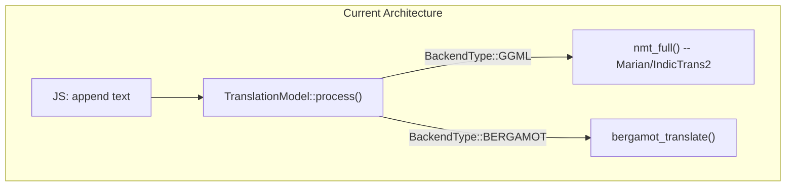
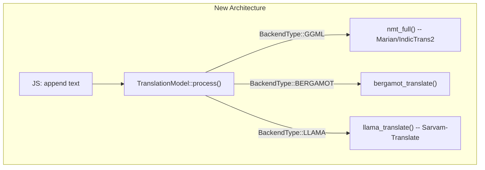
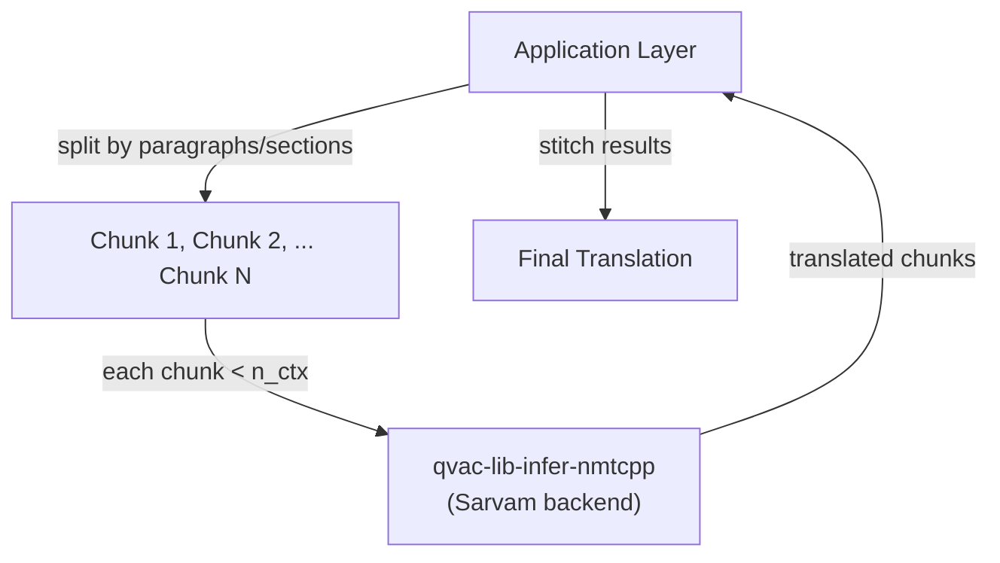

# Add Sarvam-Translate (llama.cpp) Backend to qvac-lib-infer-nmtcpp

Target: `/mnt/c/Users/alokr/Desktop/QVAC/translation/qvac-lib-infer-nmtcpp/`

## Architecture

The existing package already supports two backends behind conditional compilation:

We add a third backend using the identical pattern:

The key insight: the existing `BackendType` enum and `#ifdef HAVE_BERGAMOT` pattern gives us an exact template. We replicate it with `#ifdef HAVE_LLAMA` / `BackendType::LLAMA`.

## Context Window and Document Chunking

Sarvam-Translate uses `n_ctx = 8192` tokens by default. This is the **total** token budget for a single request -- input (system prompt + source text) and output (translation) combined.

| n_ctx | Approx. capacity | Peak RAM |
|-------|-------------------|----------|
| 8192 | ~5-6 pages of English | ~3.3 GB |
| 16384 | ~10-12 pages | ~4-5 GB |
| 32768 | ~20-25 pages | ~6-8 GB |
| 131072 (model max) | ~80-100 pages | ~50+ GB |

For comparison, IndicTrans2 has a 256-token context (1-2 sentences per call).

**What happens when input exceeds n_ctx?** Tokens beyond the limit are silently dropped -- the model produces an incomplete or garbled translation with no error.

**Who handles large documents?**

The translation backend (`llama_translate_process()`) is a **single-pass, fixed-context API**. It does not split or chunk input. This is by design -- the same pattern used by IndicTrans2, Bergamot, and every major translation API (Google Translate, DeepL, OpenAI).

**Document chunking is the caller/application layer's responsibility:**

This keeps the translation backend simple and predictable. The application calling `TranslationNmtcpp` should:
1. Estimate token count of the input (rough rule: 1 token ≈ 4 chars for English, ≈ 2-3 chars for Indic scripts)
2. If input fits within `n_ctx` (minus ~2048 tokens reserved for output), send as-is
3. If not, split by paragraph or section boundaries, translate each chunk, and join the results

This is no different from how IndicTrans2 is already used -- callers split text into sentences before feeding them in. The only change is the chunk granularity: **paragraphs/sections** for Sarvam instead of **sentences** for IndicTrans2.

## Changes (8 files: 2 new, 6 modified)

### C++ Changes

#### 1. New: `addon/src/model-interface/llama_translate.hpp`

C API header for the llama.cpp translation wrapper. Declares `llama_translate_context`, `llama_translate_params` (n_ctx, n_threads, temperature, max_tokens), and functions for init, free, process, runtime stats, and config setters. Guarded by `#ifdef HAVE_LLAMA`. Mirrors the structure of the existing Bergamot header.

#### 2. New: `addon/src/model-interface/llama_translate.cpp`

Implementation wrapping llama.cpp APIs. Handles model loading (`llama_model_load_from_file`), Gemma-3 chat template application, tokenization, prefill (`llama_decode`), autoregressive decode loop (`common_sampler_sample`), and runtime stats collection. Mirrors the pattern in `LlamaModel.cpp` from `qvac-lib-infer-llamacpp-llm`, simplified for translation-only use.

#### 3. Modify: `addon/src/model-interface/TranslationModel.hpp`

Add `LLAMA` to the `BackendType` enum. Add `llamaCtx_` (unique_ptr to `llama_translate_context`) and `systemPrompt_` members, all under `#ifdef HAVE_LLAMA`.

#### 4. Modify: `addon/src/model-interface/TranslationModel.cpp`

Add `#ifdef HAVE_LLAMA` branches in 7 methods (same pattern as existing Bergamot branches):
- `detectBackendType()` -- detect `.gguf` files → return `BackendType::LLAMA`
- `load()` -- init `llamaCtx_` via `llama_translate_init()`
- `unload()` -- reset `llamaCtx_`
- `isLoaded()` -- check `llamaCtx_ != nullptr`
- `process()` -- call `llama_translate_process()` with system prompt + input text
- `runtimeStats()` -- call `llama_translate_get_runtime_stats()`
- `updateConfig()` -- apply temperature, max_tokens to `llamaCtx_`

#### 5. Modify: `CMakeLists.txt`

Add `option(USE_LLAMA)`, `find_package(llama CONFIG REQUIRED)`, `HAVE_LLAMA` compile definition, source file, and link library -- all conditional on `USE_LLAMA`, mirroring the existing `USE_BERGAMOT` pattern.

#### 6. Modify: `vcpkg.json`

Add `llama-cpp` as an optional feature dependency (`"llama"` feature) so vcpkg provides the `llama.cpp` library when `USE_LLAMA` is enabled.

**How `llama.cpp` is obtained -- the full chain:**

1. **vcpkg.json** declares `llama-cpp` as an optional feature dependency
2. When building with `-D USE_LLAMA=ON`, CMake appends `"llama"` to `VCPKG_MANIFEST_FEATURES`
3. **vcpkg** automatically downloads, compiles, and installs `llama.cpp` from its ports registry
4. **CMake** finds it via `find_package(llama CONFIG REQUIRED)` and links it to the addon
5. No manual download or system-level installation of `llama.cpp` is needed -- vcpkg handles everything

This is the same mechanism already used for Bergamot (`USE_BERGAMOT` + vcpkg feature). Building without `-D USE_LLAMA=ON` skips the feature entirely -- vcpkg does not download `llama.cpp` and the binary is identical to before.

### JavaScript Changes

#### 7. Modify: `index.js`

- Add `Sarvam` to `ModelTypes` enum
- Add `SARVAM_LANG_NAMES` map (language codes → display names, e.g. `'hi' → 'Hindi'`)
- Add `_runSarvam()` method that constructs a JSON payload with system prompt ("Translate the text below to {lang}") and user text, then sends it through the addon
- Update `_runInternal()` to route to `_runSarvam()` when `ModelTypes.Sarvam` is selected

#### 8. `package.json` -- no changes needed

The native addon is already built via `bare-make` which invokes CMake. The `USE_LLAMA` flag is passed at build time: `bare-make generate -D USE_LLAMA=ON && bare-make build && bare-make install`

## Detection Logic

The `detectBackendType()` method checks in this order:

1. **GGUF files** (`.gguf` extension) → `BackendType::LLAMA` (Sarvam / decoder-only LLMs)
2. **Bergamot files** (`.intgemm` or `vocab.*.spm`) → `BackendType::BERGAMOT`
3. **Default** → `BackendType::GGML` (Marian / IndicTrans2)

## What does NOT change

- All existing GGML NMT (Marian, IndicTrans2) functionality is untouched
- All existing Bergamot functionality is untouched
- The `IndicProcessor` preprocessing/postprocessing is untouched
- The C++ Addon template, JS interface (`marian.js`), and binding layer are untouched
- Build without `-D USE_LLAMA=ON` produces the exact same binary as before

